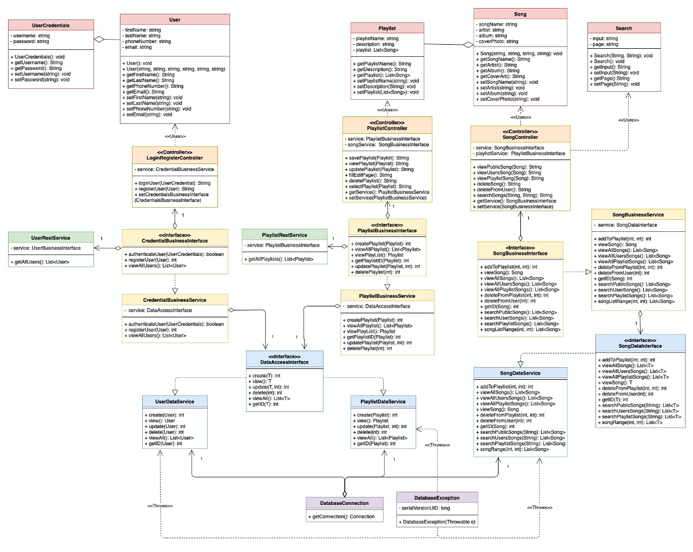
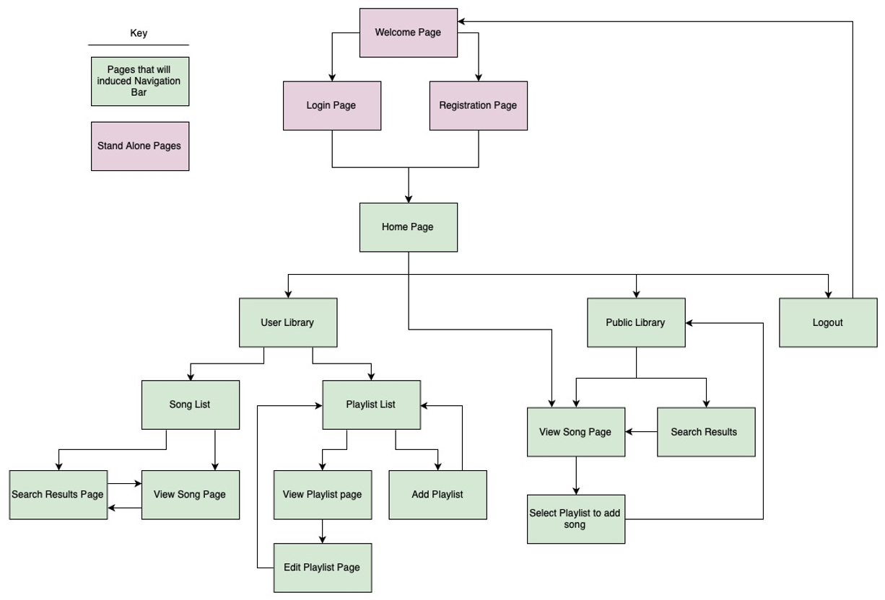
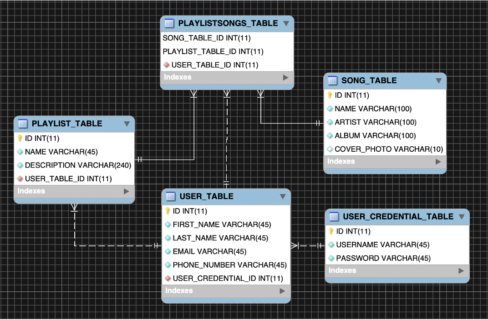
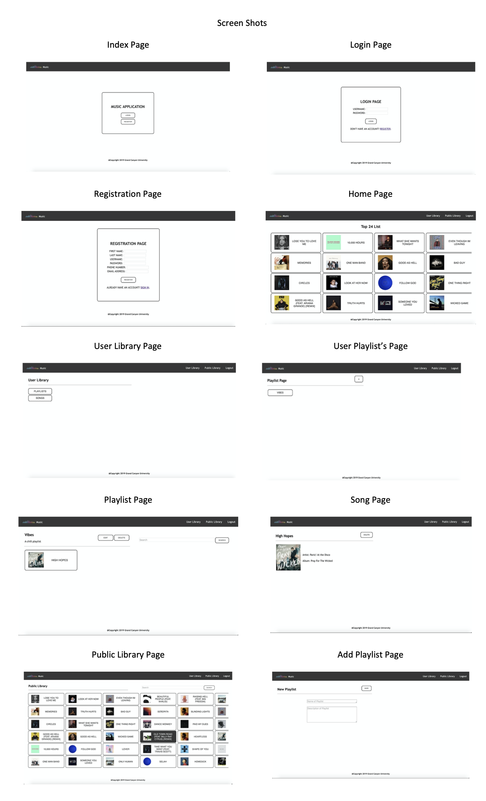

# Music Application Enterpise Java Application

A project completed by my partner and I to utilized the Enterpise Java framework to create a web based music application. We got the design mainly from apple music and spotify inorder to have a clean looking website. The application allows you to create your own playlist with the songs in the database. It utilizes Java Server Faces to be able to create templates for the pages to have a uniform design.

<h3>Technologies Used:</h3>
Java: Java SE 8 [1.8.0_221] 
IDE: Red Hat CodeReady Studio 12.12.0.GA 
Server: RedHat JBoss Enterpise Application Platform 7.1 

<h3>Documentation:</h3>

Attached below are all the UML and Diagrams used throught the creation of the project as well screen shots of the final product running. 

<h4>UML Diagram</h4>

	

<h4>Site Map Diagram</h4>

	

<h4>ER Diagram</h4>

	

<h4>Final Product</h4>

	

